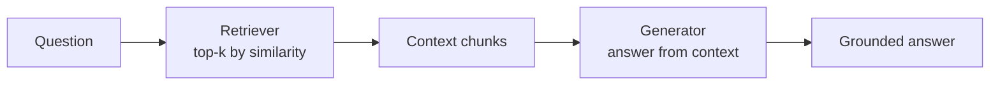

import CodeTabs from '../../components/ui/CodeTabs.astro';

## What you'll learn

**RAG** = retrieve relevant documents, then let the model read them and answer.
It's the most widely used LLM pattern because it makes answers **grounded**
(quoting real sources) and **updatable** (change the docs, not the model).

Run the demo and read the **trace**: you'll see the retrieval step (with
similarity scores) followed by the grounded generation step.

## The pipeline



1. **Retrieve** the top-k chunks for the question (Project 02's machinery).
2. **Augment** the prompt by inserting those chunks as context.
3. **Generate** an answer grounded in that context.

<CodeTabs>
  <Fragment slot="js">
```js
import { ragPipeline, loadCorpus } from '@lib/js';

const corpus = await loadCorpus('knowledge-base', import.meta.env.BASE_URL);
const { answer, trace } = ragPipeline('What is retrieval augmented generation?', corpus);

// `trace` records each step: retrieve → answer, so you can inspect the mechanics.
```
  </Fragment>
  <Fragment slot="python">
```python
from _shared.data import load_corpus
from rag import rag_pipeline

corpus = load_corpus("knowledge-base")
result = rag_pipeline("What is retrieval augmented generation?", corpus)
print(result["answer"])
for step in result["trace"]:
    print(step["step"], step["actor"], step["detail"])
```
  </Fragment>
</CodeTabs>

## Design choices that matter

- **Chunk size.** Too big wastes the context window; too small splits ideas. (See the *Chunking* note.)
- **k.** How many chunks to retrieve — balance recall vs. noise.
- **Grounding instruction.** Tell the model to answer *only* from the context to cut hallucination.

> RAG answers from a *single* retrieval. When questions are vague or multi-part, you
> want the model to retrieve, judge, and retry — that's **Agentic RAG**, next.
