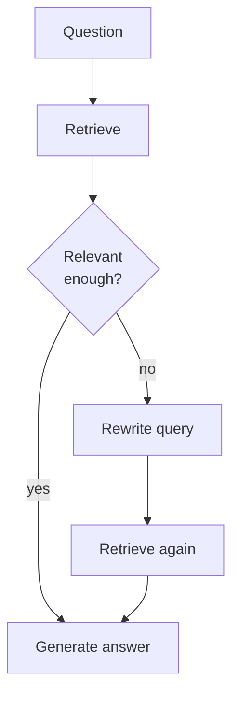

import CodeTabs from '../../components/ui/CodeTabs.astro';

## What you'll learn

Classic RAG retrieves **once**. **Agentic RAG** wraps retrieval in a small
reasoning loop: the agent **grades** the retrieved context, and if it looks weak
it **rewrites the query** and retrieves again. This self-correction dramatically
improves answers to vague or poorly-worded questions.

Watch the trace: when the top similarity falls below a threshold, you'll see a
`think` step rewrite the query and a *second* retrieval pass.

## The loop



<CodeTabs>
  <Fragment slot="js">
```js
import { agenticRagPipeline, loadCorpus } from '@lib/js';

const corpus = await loadCorpus('knowledge-base', import.meta.env.BASE_URL);
const { answer, trace } = agenticRagPipeline('how does it correct itself', corpus);

// Look for the `critique` step (relevance score vs threshold) and a possible
// `think` step that rewrites the query before a second retrieval.
```
  </Fragment>
  <Fragment slot="python">
```python
from _shared.data import load_corpus
from agentic_rag import agentic_rag_pipeline

corpus = load_corpus("knowledge-base")
result = agentic_rag_pipeline("how does it correct itself", corpus)
for step in result["trace"]:
    print(step["kind"], "-", step["detail"])
```
  </Fragment>
</CodeTabs>

## Patterns you can add

- **Relevance grading.** Score retrieved chunks and discard weak ones.
- **Query rewriting / expansion.** Add synonyms or entities to recover recall.
- **Decomposition.** Split a multi-part question into sub-questions, retrieve for each.
- **Loop limit.** Always cap iterations so the agent can't spin forever.

> Here a *single* agent reasons over retrieval. Next we split the work across
> *several specialised* agents — a **multi-agent system**.
