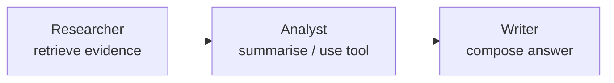

import CodeTabs from '../../components/ui/CodeTabs.astro';

## What you'll learn

Instead of one agent doing everything, a **multi-agent system** gives each agent
a narrow role and chains them together. Smaller, focused prompts are easier to
control, test, and debug.

Our pipeline uses three roles:

- **Researcher** — gathers supporting evidence via retrieval.
- **Analyst** — interprets the evidence (and may call a tool).
- **Writer** — composes the final answer from evidence + analysis.

The trace shows each role's contribution and the **handoffs** between them.

## The handoff chain



<CodeTabs>
  <Fragment slot="js">
```js
import { multiAgentPipeline, loadCorpus } from '@lib/js';

const corpus = await loadCorpus('knowledge-base', import.meta.env.BASE_URL);
const { answer, trace } = multiAgentPipeline('Why do agents use tools?', corpus);

// trace actors: researcher → analyst → writer
```
  </Fragment>
  <Fragment slot="python">
```python
from _shared.data import load_corpus
from multi_agent import multi_agent_pipeline

corpus = load_corpus("knowledge-base")
result = multi_agent_pipeline("Why do agents use tools?", corpus)
print(result["answer"])
```
  </Fragment>
</CodeTabs>

## Why specialise

- **Simpler prompts.** Each agent has one job, so its instructions stay short and reliable.
- **Reusability.** The researcher can serve many workflows.
- **Debuggability.** When output is wrong, the trace tells you *which* agent to fix.

> A fixed chain works for predictable tasks. When you need to *route* work and run
> agents in parallel teams, you add a supervisor — that's **Agent Teams**, next.
