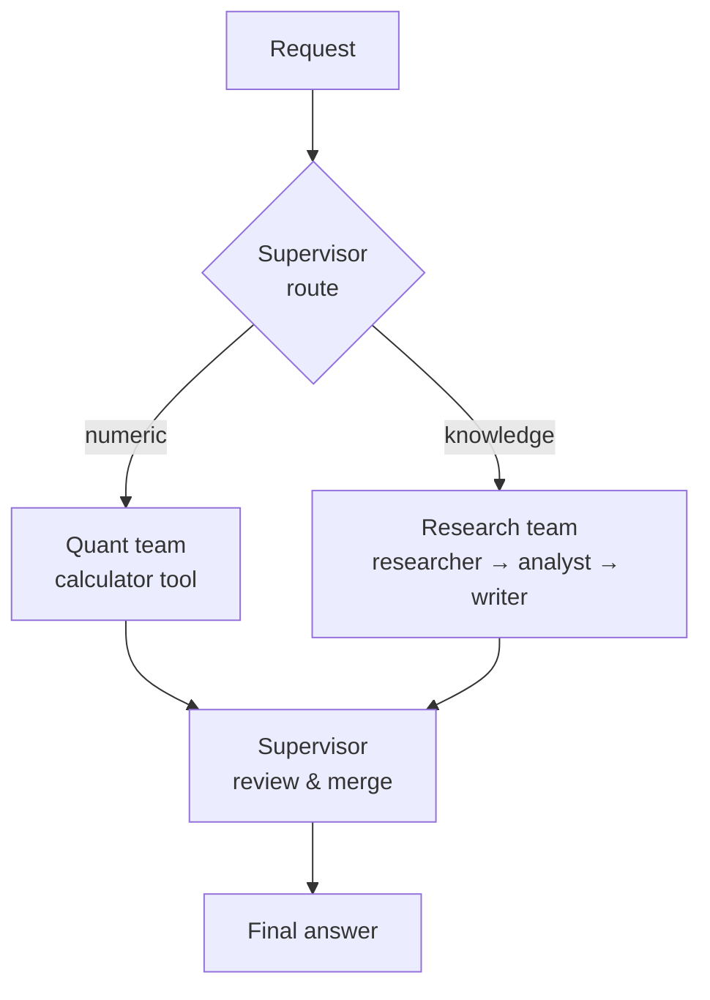

import CodeTabs from '../../components/ui/CodeTabs.astro';

## What you'll learn

**Agent teams** add a layer of orchestration on top of multi-agent systems. A
**supervisor** inspects each request, **routes** it to the most suitable team,
lets that team run its own internal agents, then **reviews and returns** the
final answer.

Try `What is 144 / 12?` (routed to the **quant team**) versus `Summarise
multi-agent systems` (routed to the **research team**, which is the whole
Project 06 pipeline running as a sub-team).

## The orchestration pattern



<CodeTabs>
  <Fragment slot="js">
```js
import { agentTeamsPipeline, loadCorpus } from '@lib/js';

const corpus = await loadCorpus('knowledge-base', import.meta.env.BASE_URL);

agentTeamsPipeline('What is 144 / 12?', corpus);        // → quant-team
agentTeamsPipeline('Summarise multi-agent systems', corpus); // → research-team

// The trace shows the supervisor's `route` step and the delegated team's steps.
```
  </Fragment>
  <Fragment slot="python">
```python
from _shared.data import load_corpus
from agent_teams import agent_teams_pipeline

corpus = load_corpus("knowledge-base")
print(agent_teams_pipeline("What is 144 / 12?", corpus)["answer"])
print(agent_teams_pipeline("Summarise multi-agent systems", corpus)["answer"])
```
  </Fragment>
</CodeTabs>

## Orchestration principles

- **Routing.** The supervisor's only job is to send work to the right place — keep it simple and explicit.
- **Encapsulation.** Each team owns its internal agents; the supervisor sees only inputs and outputs.
- **Review.** The supervisor can validate or merge results before returning them.
- **Scales down.** When a task is trivial, a good orchestrator delegates to *one* agent rather than the whole org.

> You've now gone from a single prompt to a coordinated organisation of agents.
> Revisit the **Notes** for the patterns, and the **Resources** for the papers
> behind each idea.
